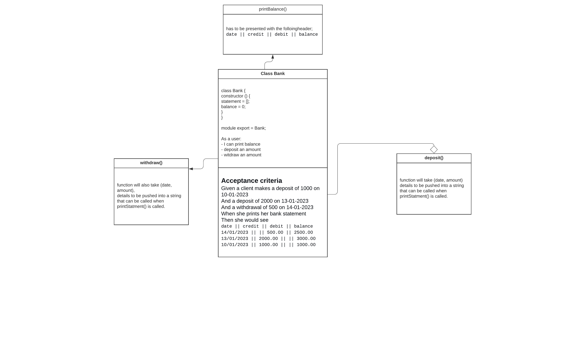
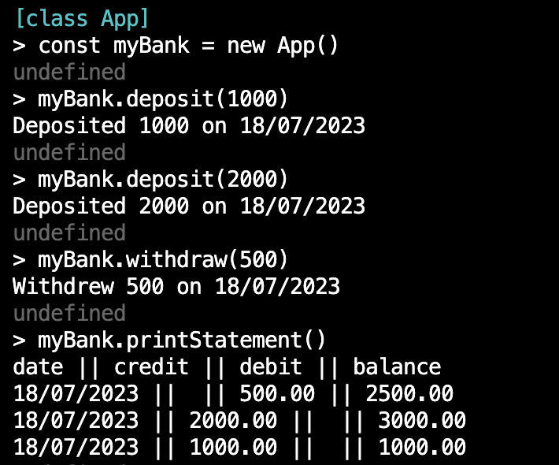

# Bank Test Challenge (using JavaScript and Jest)

## Introduction

I'll be working on a tech test called the "Bank Test Challenge". This practice session is about demonstrating my Object-Oriented (OO) design and Test-Driven Development (TDD) skills.

The challenge requires me to implement a simple banking system that allows interactions via a REPL like  . The functionalities I need to implement are deposits, withdrawals, and printing of the account statement, including date, amount, and balance.

Data storage for this challenge can be kept in memory, so I won't need to use a database.

## Acceptance Criteria

Given a client makes a deposit of 1000 on 10-01-2023
And a deposit of 2000 on 13-01-2023
And a withdrawal of 500 on 14-01-2023
When she prints her bank statement
Then she would see:

date || credit || debit || balance
14/01/2023 || || 500.00 || 2500.00
13/01/2023 || 2000.00 || || 3000.00
10/01/2023 || 1000.00 || || 1000.00

## Basic Diagram

## Implementation Details

For this challenge, I'll be using  and the  testing framework to ensure my code is well-tested. I've created an `app.js` file where I'll implement the bank functionality and a test file where I'll write the Jest test cases for each requirement.

## Running the Code
1. cd into bank-test directory and run node
2. load app.js
3. follow the steps below

To run the code and test the bank functionality, follow these steps:

1. Clone the repository to your local machine.
2. Navigate to the project directory.
3. Open a terminal or command prompt.
4. Run the following command to install the dependencies:
npm install

5. Run the tests using the following command:
npm test

The test cases will be executed, and you should see the output showing if the code passes the acceptance criteria.

Let's start working on the challenge and see if we can create a functional and well-tested banking application!

